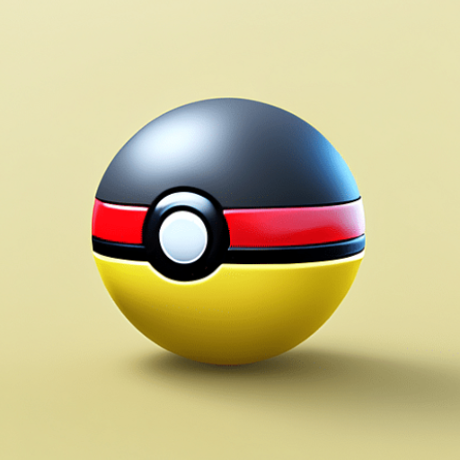
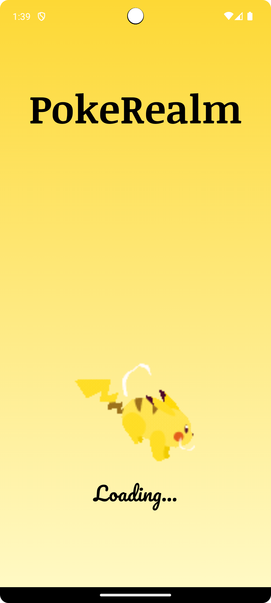
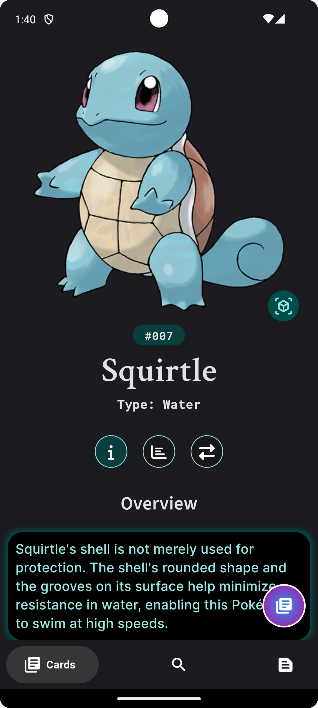
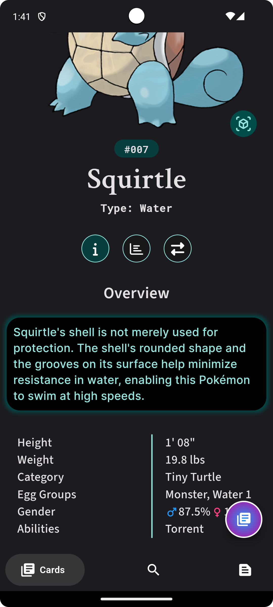
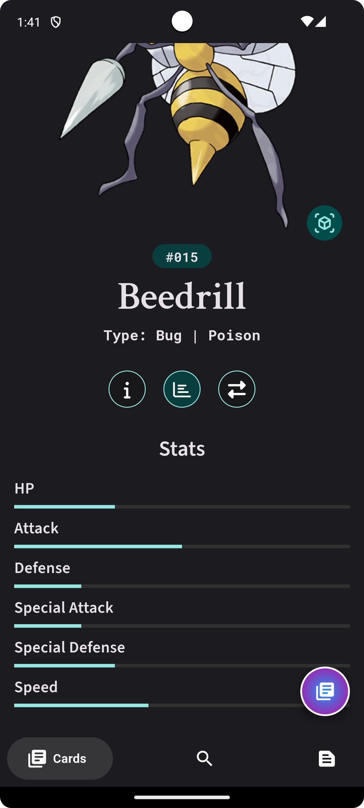
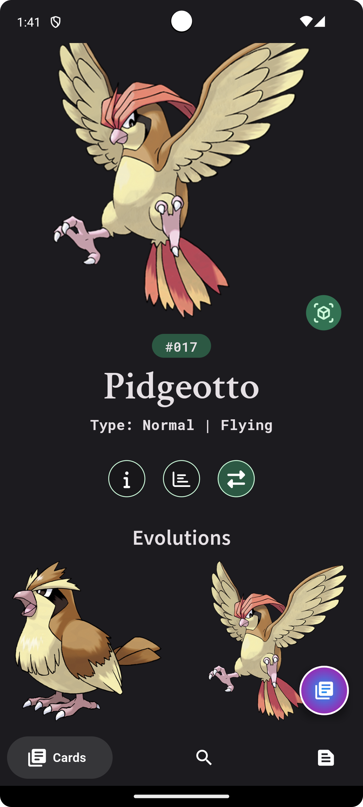
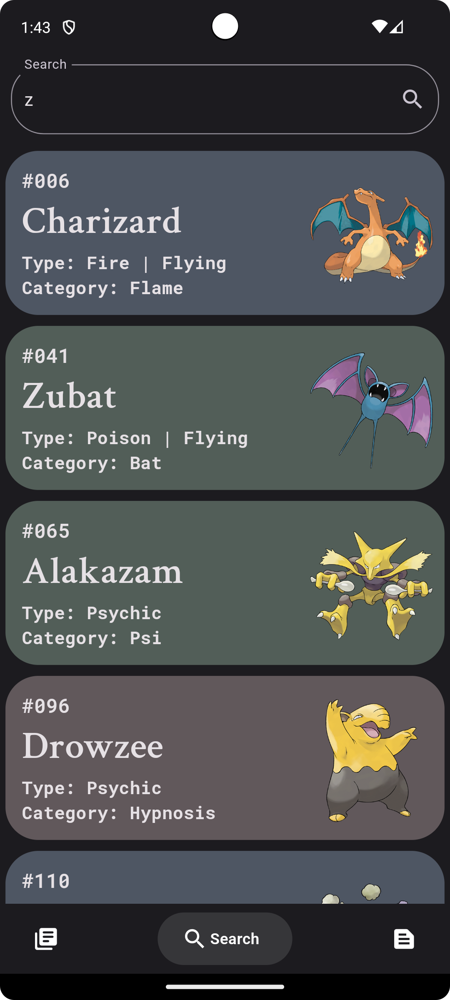
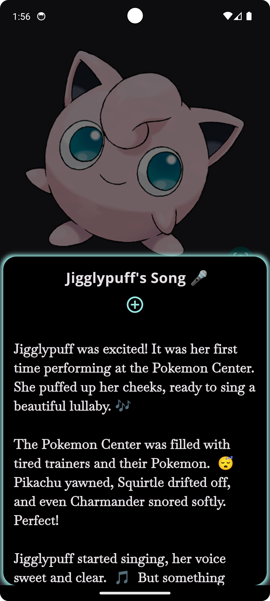
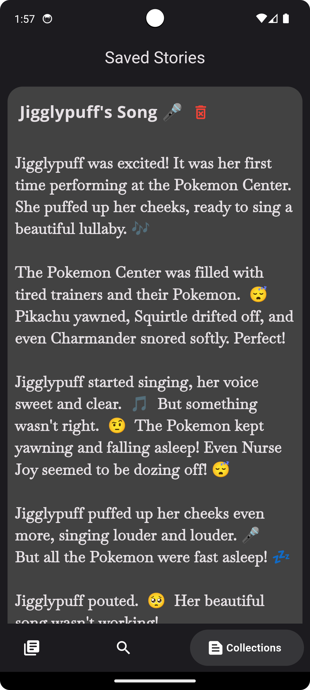

# PokeRealm 

## 🌟 Overview

PokeRealm is a fun and interactive Android app where you can search and learn about your favorite Pokémon, generate stories for each Pokémon using the **Gemini API** , and even bring Pokémon to life with augmented reality (AR) capabilities. Save your favorite stories to your local device using **Hive Database**. PokeRealm also includes powerful search functionalities to help you find any Pokémon quickly.

## 🔥 Features

- 🔍 **Search & Learn**: Discover detailed information about your favorite Pokémon.
- 📖 **Story Generation**: Generate unique stories for each Pokémon using 
- 🌐 **Augmented Reality**: Bring Pokémon to life in your world using AR capabilities.
- ❤️ **Save Favorites**: Save your favorite Pokémon stories locally using 
- 🧐 **Advanced Search**: Use our advanced search functionalities to find any Pokémon.

## 🕶️ AR Capabilities

To use the AR features, make sure your device supports **ARCore** .  
[Check supported devices here](https://developers.google.com/ar/devices) 

## 📸 App Screenshots

        
        
        
        
        

        
        
        
        
        

## 📥 Installation

To use PokeRealm on your Android device, download the latest APK from the link below:

